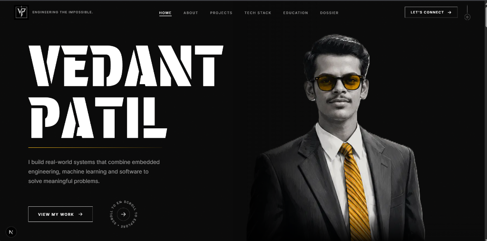
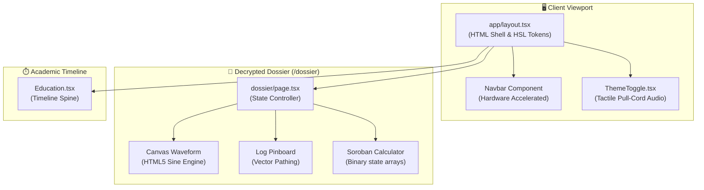
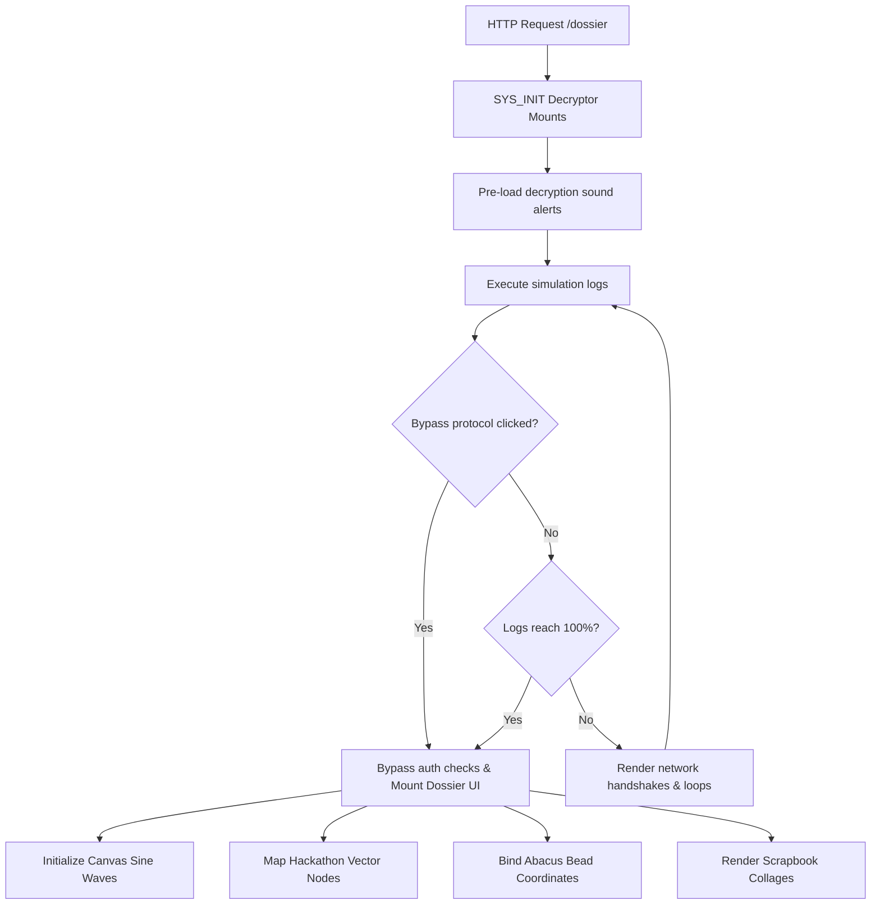

<div align="center">



# 🚀 Vedant Patil — Premium Developer Portfolio & Interactive Dossier

### A next-generation full-stack developer portfolio built with Next.js 16, React 19, and TypeScript, featuring a high-performance interactive espionage dossier, 60fps hardware-accelerated animations, and zero-JS-library custom engines.


</div>

---

## 🌟 The Vision

A personal developer portfolio designed to **wow** at first glance. Featuring a dark-mode landing page and an espionage-themed interactive dossier at `/dossier`. Every animation, scroll effect, and component is hand-crafted and highly optimized for maximum rendering performance, utilizing real WebAudio synthesizers, HTML5 Canvas animations, a functional Soroban abacus, and a hackathon evidence pinboard — **all rendered client-side with zero external JS animation libraries.**

---

## 🔥 Key Features & Modules

| Module | Description | Status |
|---|---|---|
| **Editorial Hero Interface** | Heavy typography-driven intro layout featuring dynamic filtering, parallax layers, and hardware-accelerated animations. | ✅ Live |
| **Experience Timeline** | Modern professional journey timeline with responsive card layouts, WebP/AVIF optimized assets, and clean editorial UI. | ✅ Live |
| **Tactile Theme Switch** | Sound-faded pull-cord toggle utilizing local WebAudio elements and localStorage persistence. | ✅ Live |
| **SYS_INIT Decryptor** | Espionage terminal interface locking content behind network handshakes, key logging, and bypass loops. | ✅ Live |
| **Audio-Wave Synthesizer** | HTML5 Canvas wave generator compiling floating trigonometric sine values and sound-notation overlays. | ✅ Live |
| **Mission Log Pinboard** | Glowing red threads mapping hackathon nodes with interactive coordinate terminals. | ✅ Live |
| **Soroban Abacus** | Fully functional Japanese abacus simulator compiling active bead binary grids. | ✅ Live |
| **Musician Collage** | Alternating performance scrapbook grids featuring carefully tuned padding, drop shadows, and static layouts. | ✅ Live |

---

## ⚡ Performance Optimizations & Scroll Jank Fixes

To achieve a flawless **60 FPS** scroll experience across both desktop and mobile, deep rendering pipeline optimizations were implemented:

### 1. Eliminating Scroll Jank & Mobile Touch Inertia Jitter
We conducted a deep root-cause investigation into a 300–500ms scroll micro-jump. We identified and fixed the following:
*   **Mobile Scroll-Snap Engine:** Removed redundant `scroll-snap-type: y proximity` on the HTML root which was causing the browser to constantly evaluate scroll frames for snap targets (even when none existed), leading to touch scroll inertia stutter.
*   **Desktop Compositor Paint Lag:** Optimized `backdrop-filter: blur(16px)` on the fixed `.navbar.scrolled`. Real-time GPU blur processing of heavy under-scroll layers (like the SVG `.filmGrain`) was causing composite thread bottlenecks. We implemented selective opacity and solid backgrounds to keep paint tasks under 16.7ms.
*   **Hardware Compositing Layer Management:** Reduced GPU layer explosion by removing excessive `will-change: transform` tags, preventing graphics memory saturation while scrolling the Dossier.

### 2. GPU Compositor Layer Promotion
Standard browsers run transitions on the CPU, causing full repaints. We promote active cards to their own **GPU Compositing Layer**:
```css
.photoCardCollage, .leaderInfoCard {
  will-change: transform; /* Used sparingly to prevent memory leaks */
  backface-visibility: hidden;
  transform: translate3d(0, 0, 0); /* Forces GPU hardware acceleration */
}
```

### 3. CSS Paint Containment
Implemented `content-visibility: auto` with `contain-intrinsic-size` on heavy sections, instructing the browser to skip layout and paint calculations for deep-fold content until it enters the viewport.

### 4. Next.js Native Image Optimization
Configured native Next.js `<Image />` components with aggressive AVIF/WebP generation, strict `sizes` definitions mapping precisely to CSS media queries, and `priority` fetching for LCP assets to achieve near-instant above-the-fold paint times.

---

## 🏛️ System Architecture

The project is structured into modular context layouts, timeline segments, and secure dossier modules:



---

## 🔐 Decryption & Initialization Pipeline

Content in the secure dossier is protected by a multi-stage initial handshake process before compiling DOM grids:



---

## 🛠️ Tech Stack & Tooling

<div align="center">

<table>
  <tr>
    <td align="center" width="120">
      <br/>
      <sub><b>Next.js 16</b></sub>
    </td>
    <td align="center" width="120">
      <br/>
      <sub><b>React 19</b></sub>
    </td>
    <td align="center" width="120">
      <br/>
      <sub><b>TypeScript</b></sub>
    </td>
    <td align="center" width="120">
      <br/>
      <sub><b>CSS Modules</b></sub>
    </td>
  </tr>
  <tr>
    <td align="center" width="120">
      <br/>
      <sub><b>HTML5 Canvas</b></sub>
    </td>
    <td align="center" width="120">
      <br/>
      <sub><b>Dev Server</b></sub>
    </td>
    <td align="center" width="120">
      <br/>
      <sub><b>Version Control</b></sub>
    </td>
    <td align="center" width="120">
      <br/>
      <sub><b>Development IDE</b></sub>
    </td>
  </tr>
</table>

<br/>

<!-- Secondary Badges -->


</div>

---

## 📐 Detailed Engineering Deep-Dives

<details>
<summary><strong>🌊 Canvas Trigonometric Sine Wave Engine</strong></summary>

The audio wave visualization engine in the Musician section maps classical vocals using HTML5 Canvas 2D math. We plot multiple overlapping sine waves using a dynamic time phase offset ($\phi$) to simulate harmonics:

$$y(x) = A \cdot \sin\left(\frac{2\pi \cdot x}{\lambda} + \phi\right)$$

We compile three distinct layers with variable transparency values, contrasting phase increments, and different frequencies to create a natural, organic acoustic ripple.
</details>

<details>
<summary><strong>🧮 Soroban Abacus Column Matrix</strong></summary>

Calculates active mathematical states across columns using a binary alignment array:
```json
{
  "column": 0,
  "upperBead": 0,
  "lowerBeads": [1, 1, 0, 0]
}
```
*Note: `upperBead` values (0: active/down) and `lowerBeads` indices (1: active/up) determine column value summation.*
</details>

<details>
<summary><strong>📍 Hackathon Node Object</strong></summary>

Used by the dynamic canvas log pin-board to map node locations and trigger encrypted modal payloads:
```json
{
  "id": "log-01",
  "name": "IO Hackathon 2026",
  "achievement": "1st Place Winner",
  "coordinates": { "x": 120, "y": 340 }
}
```
</details>

---

## 🔮 Future Roadmap

1. **Localized WebGL Audio Spectrogram** — Implement live microphone diagnostics that map voice frequencies directly to the Canvas audio wave generator.
2. **Interactive Decryption Keys** — Add custom key-matching inputs inside the `SYS_INIT` console instead of a single bypass button.
3. **Parchment Overlay Shaders** — Integrate lightweight WebGL noise shaders over the Artist mode background to simulate real organic paper fiber textures.

---

<div align="center">

Built with **Next.js 16** • **React 19** • **TypeScript** • **Pure CSS Modules** • **100% Client-Side WebAudio & Canvas**

*"Where Performance Meets Aesthetics."* 🚀

</div>
