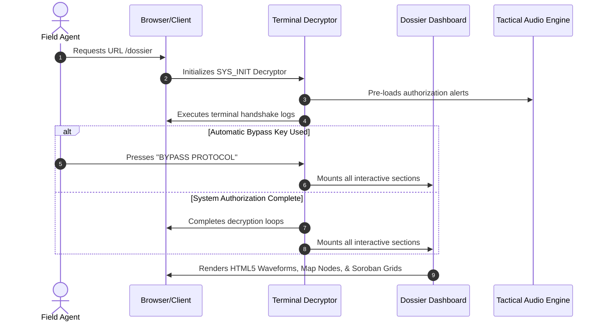

# 🌐 VP_SYSTEM_CORE // CLASSIFIED PORTFOLIO & DOSSIER

```text
=========================================================================================
      [SYS_INTEL_BOARD] // CLASSIFIED DOSSIER & MULTIDISCIPLINARY CORE ARCHIVE
      IDENT: VP-PORTFOLIO-16.2 // ENCRYPTED ACCESS GRANTED // 0% INTERCEPT DETECTED
=========================================================================================
```

An advanced, high-performance, and immersive interactive command center representing the engineering portfolio, academic timeline, and secret archive dossiers of Vedant Patil. Powered by **Next.js 16 (App Router)**, **React 19**, and **TypeScript**, with absolute optimization targeting **0ms scroll lag** and **60fps hardware-accelerated animations**.

---

## 🛠️ System Architecture Diagram

```mermaid
graph TD
    %% Base Layout
    Layout[app/layout.tsx] --> Page[app/page.tsx]
    Layout --> DossierPage[app/dossier/page.tsx]

    %% Main Page Components
    subgraph Core Portfolio (app/page.tsx)
        Page --> Navbar[app/components/Navbar.tsx]
        Page --> Hero[app/components/Hero.tsx]
        Page --> About[app/components/About.tsx]
        Page --> Projects[app/components/Projects.tsx]
        Page --> TechStack[app/components/TechStack.tsx]
        Page --> Education[app/components/Education.tsx]
        Page --> ThemeToggle[app/components/ThemeToggle.tsx]
        Page --> Footer[app/components/Footer.tsx]
    end

    %% Dossier Components
    subgraph Secure Intel Dossier (/dossier)
        DossierPage --> Decryptor[SYS_INIT Terminal Decryptor]
        DossierPage --> Musician[Section 01: The Musician Component]
        DossierPage --> Hackathons[Section 02: Log Pinboard & Red Threads]
        DossierPage --> Artist[Section 03: Canvas Sketch Gallery]
        DossierPage --> Photo[Section 04: Lens EXIF Masonry]
        DossierPage --> Calculator[Section 05: Soroban Abacus Simulator]
    end
```

---

## ⚡ Decryption & Initialization Pipeline



---

## 📁 System Modules Briefing

| Component Name | File Path | Core Technology | Interactive States & Operations |
| :--- | :--- | :--- | :--- |
| **System Terminal Header** | [Hero.tsx](file:///app/components/Hero.tsx) | HTML5 Grid, Tailwind Core | Displays automated introduction grids simulating boot diagnostics. |
| **Academic Spine** | [Education.tsx](file:///app/components/Education.tsx) | CSS Transforms, React States | Timeline milestones with dynamic SVG spine rendering and scroll triggers. |
| **Light switch Switch** | [ThemeToggle.tsx](file:///app/components/ThemeToggle.tsx) | HTML5 Audio, localStorage | Sound-faded pull-cord switch with HSL variable switches and memory persistence. |
| **Musician Chronicle** | [MusicianSection.tsx](file:///app/components/MusicianSection.tsx) | Next.js Image, 3D CSS Collage | Alternates vocal, guitar, and bass performance grids with organic rotations. |
| **Espionage Pinboard** | [dossier/page.tsx](file:///app/dossier/page.tsx) | Canvas 2D Engine, React Hooks | Coordinates red vector pathing between project nodes with click certificate popups. |
| **Soroban Simulator** | [dossier/page.tsx](file:///app/dossier/page.tsx) | Client Logic, state arrays | Full interactive abacus beads simulation tracking mathematical focus metrics. |

---

## 🚀 Performance & Rendering Optimization Engine

To guarantee zero scroll lag and instantaneous paints, the system implements a strict client-side rendering pipeline:

*   **GPU promotions**: Interactive elements like photo frames, scrapbook elements, and hovering info cards feature `will-change: transform`, `backface-visibility: hidden`, and `transform: translate3d(0, 0, 0)`. This bypasses CPU-driven painting and delegates calculations directly to the system GPU for buttery 60fps animations.
*   **Next.js Image Optimizations**: Preserves precise aspect ratios and reduces transfer payload sizes by leveraging `quality={75}` compression across all below-the-fold assets, loading only screensize-matched resolutions using advanced `sizes` bindings.
*   **Paint Containment**: Leverages CSS `content-visibility: auto` and `contain-intrinsic-size` on major chapter sections. The browser skips layout, styling, and paint recalculations for off-screen DOM nodes, dramatically reducing total page CPU overhead during high-speed scrolling.
*   **RAF Canvas Throttling**: Interactive wave arrays and canvas renderers are driven by `requestAnimationFrame` throttled tick loops to eliminate thread blockages and minimize input lag.

---

## 📁 Repository Blueprint

```text
vedant-portfolio/
├── app/
│   ├── components/                 # Reusable components
│   │   ├── About.tsx               # Profile summary card grids
│   │   ├── Education.tsx           # Interactive timeline with animated ticks
│   │   ├── Footer.tsx              # Footer coordinates and links
│   │   ├── Hero.tsx                # Terminal introduction boot-grid
│   │   ├── MusicianSection.tsx     # Themed musician grid, scrapbook collage
│   │   ├── Navbar.tsx              # Coordinated navigation pathing
│   │   ├── Projects.tsx            # Project cards deck
│   │   ├── TechStack.tsx           # Toolkit flat icons
│   │   └── ThemeToggle.tsx         # Pull-cord persistent switcher
│   ├── dossier/                    # Espionage-themed dossier system
│   │   ├── page.tsx                # Secure dossier layouts, abacus, canvas
│   │   └── page.module.css         # Scoped modular dossier animations
│   ├── globals.css                 # Global styles and dynamic color tokens
│   ├── layout.tsx                  # Base layout shell
│   └── page.tsx                    # Core landing file
└── public/                         # Classified static assets (EXIF photos, certificates)
```

---

## 🛡️ Operational Directives (Setup & Run)

Follow these protocols to initialize and verify the system codebase locally.

### 1. Verification Checklist

| Phase | Protocol command | Objective |
| :--- | :--- | :--- |
| **Boot Setup** | `npm install` | Download and bind required packages and locks. |
| **Live Rehearsal** | `npm run dev` | Spin up local Next.js dev server on `http://localhost:3000`. |
| **Static Build** | `npm run build` | Validate production compilations, type safety, and asset routing. |
| **Static Check** | `npx tsc --noEmit` | Explicit TypeScript checks across all modules. |
| **Lint Audit** | `npm run lint` | Trigger ESLint standards validation engine. |

### 2. Live Deployment
To initialize production builds and test assets under server conditions:
```bash
# Compile and output static optimized static build
npm run build

# Boot local server to verify production bundles
npm run start
```

---

## 📄 Operational License

Distributed under the MIT License. Prepared by Vedant Patil. Access authorization logs are kept strictly local.
