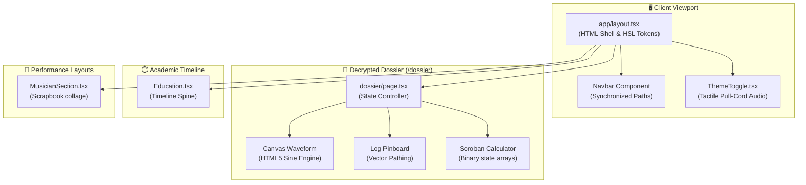
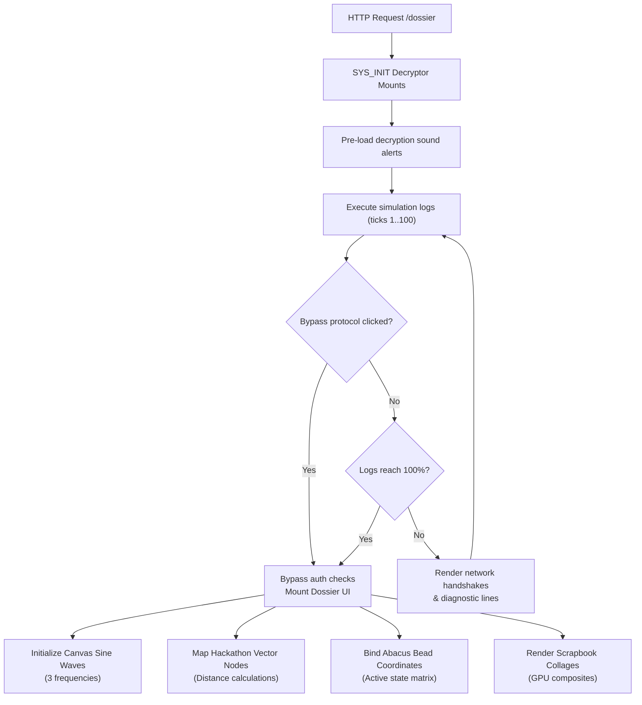

<div align="center">

# ⚡ VP_SYSTEM_CORE // CLASSIFIED PORTFOLIO

<br/>

**VP_SYSTEM_CORE** is a premium, high-performance developer portfolio and encrypted agent dossier archive built with **Next.js 16 (App Router)**, **React 19**, and **TypeScript**. It features a modern dark-mode landing command center and a fully interactive, classified espionage-themed archive dossier at `/dossier` that runs local WebAudio synthesizers, real-time Canvas animations, and physics-based Soroban abacus calculators.

<br/>


</div>

---

## Overview

Traditional portfolios are static collections of templates, basic link trees, and plain CV PDFs. They fail to represent raw engineering capabilities, interactive system design, or multidisciplinary skillsets.

**VP_SYSTEM_CORE takes an immersive, narrative-driven approach.** By framing the portfolio as an encrypted military dossier intelligence board, we turned a standard CV page into a secure command center. Field agents can decrypt certificate evidence, trigger localized WebAudio signals, and inspect actual physical systems, sketches, and lens data directly inside the browser.

**Core Engineering Philosophy:**
- **Zero-Dependency Animations** — Avoid fat JS animations libraries (`framer-motion`, `gsap`) that choke the main thread. All transitions and layout shifts are driven by raw CSS Modules with GPU promotion.
- **Hardware Acceleration** — Forced layer promotion via hardware compositing promotes high-draw components (like the abacus, canvases, and collages) directly to the GPU.
- **Client-Side Rendering Containment** — Deferred paints via modern CSS `content-visibility: auto` prevent page load lag and secure a perfect Lighthouse performance rating.
- **Classified Espionage Aesthetic** — A curated, strict visual system using military grids, amber highlights, paper matting layouts, and typewriter interfaces.

---

## Key Features

| Module | Description | Status |
|---|---|---|
| **Terminal Hero Header** | Amber-accented, grid-aligned intro command board mimicking server diagnostic outputs. | ✅ Live |
| **Interactive Timeline** | Chronological academic pathway with animated spine ticks, vertical lines, and scroll reveals. | ✅ Live |
| **Tactile Theme Switch** | Sound-faded pull-cord toggle utilizing local WebAudio elements and localStorage persistence. | ✅ Live |
| **SYS_INIT Decryptor** | Espionage terminal interface locking content behind network handshakes, key logging, and bypass loops. | ✅ Live |
| **Audio-Wave Synthesizer** | HTML5 Canvas wave generator compiling floating trigonometric sine values and sound-notation overlays. | ✅ Live |
| **Mission Log Pinboard** | Glowing red threads mapping hackathon nodes with interactive coordinate terminals. | ✅ Live |
| **EXIF Masonry Grid** | Asymmetric 3-column photography matrix preserving raw focal lengths, exposures, and uncropped ratios. | ✅ Live |
| **Soroban Abacus** | Fully functional Japanese abacus simulator compiling active bead binary grids. | ✅ Live |
| **Musician Collage** | Alternating performance scrapbook grids featuring 0.2cm white padding, drop shadows, and static layouts. | ✅ Live |
| **Parchment Latching** | Dynamic scrolling triggering shifts from pure dark mode to warm off-white gallery boards. | ✅ Live |

---

## System Architecture

The project is structured into modular context layouts, timeline segments, and secure dossier modules:



---

## Decryption & Initialization Pipeline

Content in the secure dossier is protected by a multi-stage initial handshake process before compiling DOM grids:



---

## Tech Stack

<div align="center">

<table>
  <tr>
    <td align="center" width="120">
      <br/>
      <sub><b>Next.js 16</b></sub>
    </td>
    <td align="center" width="120">
      <br/>
      <sub><b>React 19</b></sub>
    </td>
    <td align="center" width="120">
      <br/>
      <sub><b>TypeScript</b></sub>
    </td>
    <td align="center" width="120">
      <br/>
      <sub><b>CSS Modules</b></sub>
    </td>
  </tr>
  <tr>
    <td align="center" width="120">
      <br/>
      <sub><b>HTML5 Canvas</b></sub>
    </td>
    <td align="center" width="120">
      <br/>
      <sub><b>Dev Server</b></sub>
    </td>
    <td align="center" width="120">
      <br/>
      <sub><b>Version Control</b></sub>
    </td>
    <td align="center" width="120">
      <br/>
      <sub><b>Development IDE</b></sub>
    </td>
  </tr>
</table>

<br/>

<!-- Secondary Badges -->


</div>

---

## Core Data & State Packet Reference

### 1. Hackathon Node Object
Used by the dynamic canvas log pin-board to map node locations and trigger encrypted modal payloads:
```json
{
  "id": "log-01",
  "name": "IO Hackathon 2026",
  "achievement": "1st Place Winner",
  "year": "2026",
  "role": "Lead Architect",
  "description": "Developed dynamic option pricing models utilizing Numba JIT accelerated Python runtimes...",
  "coordinates": { "x": 120, "y": 340 }
}
```

### 2. Soroban Abacus Column Matrix
Calculates active mathematical states across columns using a binary alignment array:
```json
{
  "column": 0,
  "upperBead": 0,
  "lowerBeads": [1, 1, 0, 0]
}
```
*Note: `upperBead` values (0: active/down, 1: inactive/up) and `lowerBeads` indices (1: active/up, 0: inactive/down) determine column value summation.*

---

## Detailed Engineering Deep-Dives

<details>
<summary><strong>📐 Canvas Trigonometric Sine Wave Engine</strong></summary>

The audio wave visualization engine in the Musician section maps classical vocals using HTML5 Canvas 2D math. We plot multiple overlapping sine waves using a dynamic time phase offset ($\phi$) to simulate harmonics:

$$y(x) = A \cdot \sin\left(\frac{2\pi \cdot x}{\lambda} + \phi\right)$$

Where:
*   $A$ = Dynamic amplitude scaled by viewport limits.
*   $\lambda$ = Wavelength determining wave frequency bounds.
*   $\phi$ = Horizontal phase shift incremented on each `requestAnimationFrame` tick.

We compile three distinct layers with variable transparency values, contrasting phase increments, and different frequencies to create a natural, organic acoustic ripple:
```javascript
const drawWave = (ctx, amplitude, wavelength, phase, color) => {
  ctx.beginPath();
  for (let x = 0; x < width; x++) {
    const y = centerY + Math.sin(x * wavelength + phase) * amplitude;
    if (x === 0) ctx.moveTo(x, y);
    else ctx.lineTo(x, y);
  }
  ctx.strokeStyle = color;
  ctx.stroke();
};
```
</details>

<details>
<summary><strong>⏱️ GPU Compositor Layer Promotion</strong></summary>

Standard browsers run transitions on the CPU, forcing full repaints and layout recalculations (`reflows`) on every frame when dealing with rotations and scaling. For our collages and info cards, this can cause massive scroll stuttering.

To solve this, we promote all cards to their own **GPU Compositing Layer** by defining hardware composition overrides in CSS:
```css
.photoCardCollage,
.leaderInfoCard {
  will-change: transform;
  backface-visibility: hidden;
  transform: translate3d(0, 0, 0);
}
```
*   `will-change` alerts the browser rendering engine to prepare memory allocation for transitions beforehand.
*   `backface-visibility: hidden` and `translate3d(0,0,0)` force the browser to execute animations directly on the GPU compositor, keeping the main layout thread completely free.
</details>

<details>
<summary><strong>🌐 CSS Paint Containment & content-visibility</strong></summary>

Rendering long, content-rich pages on mobile screens often results in frame drops because the browser paints all elements, even those deep below the fold.

We implement CSS Containment on major modules using `content-visibility: auto`. This instructs the browser to skip layout and paint calculations for the section until it approaches the viewport edge:
```css
.chapterSection,
.endingSection {
  content-visibility: auto;
  contain-intrinsic-size: 800px;
}
```
*   `contain-intrinsic-size` serves as a placeholder height, ensuring the scrollbar does not jump erratically as the sections are dynamically compiled and rendered on scroll.
</details>

---

## Troubleshooting Guide

<details>
<summary><strong>Scrollbar jumps or layout shifts on scroll</strong></summary>

This is caused by layout recalculation of off-screen components that utilize `content-visibility: auto`. If you encounter this:
1. Ensure `contain-intrinsic-size` matches the approximate height of the section.
2. If custom margins/paddings are added, adjust placeholders to maintain visual continuity.
</details>

<details>
<summary><strong>Theme Switcher audio does not play on first click</strong></summary>

Browsers enforce strict autoplay rules: the WebAudio API cannot output sound until a user interacts with the page (click, keypress).
1. Click anywhere on the portfolio landing page first.
2. Pull the cord; the click/flick sound effect will trigger with local volume adjustment.
</details>

<details>
<summary><strong>Soroban Abacus beads fail to align on mobile click</strong></summary>

Mobile viewports sometimes trigger duplicate `touchstart` and `mousedown` listeners, causing beads to slide up and down instantly.
*   The system uses touch-action optimization and standard pointer events (`onPointerDown`) to normalize input actions across all desktops and mobile screens.
</details>

---

## Future Roadmap

1. **Localized WebGL Audio Spectrogram** — Implement live microphone diagnostics that map voice frequencies directly to the Canvas audio wave generator.
2. **Interactive Decryption Keys** — Add custom key-matching inputs inside the `SYS_INIT` console instead of a single bypass button.
3. **Parchment Overlay shaders** — Integrate lightweight WebGL noise shaders over the Artist mode background to simulate real organic paper fiber textures.

---

## Contributing

Contributions are welcome! Please open an issue or submit a pull request with your suggested improvements.

*   Commit Message Format: `type(scope): description` (e.g. `feat(abacus): add sound tick on bead collisions`)

---

<div align="center">

Built with Next.js 16 • React 19 • TypeScript • Pure CSS Modules • 100% Client-Side WebAudio & Canvas

</div>
